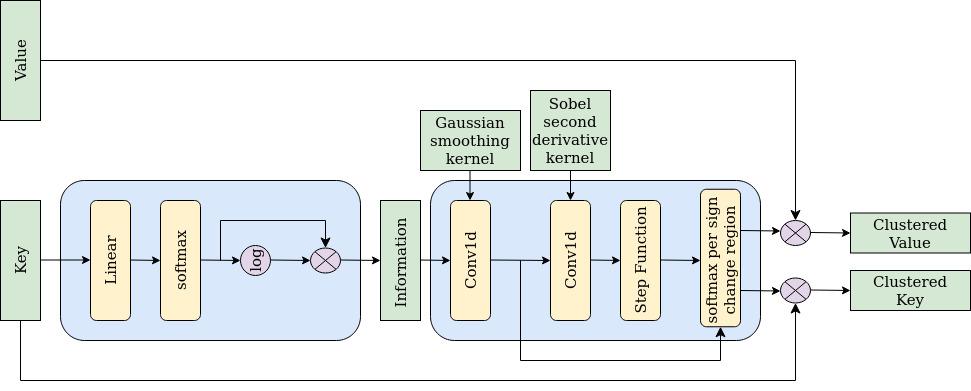

# ENACT: Entropy-based Attention Clustering for detection Transformers
This is the official implementation of the paper ENACT: Entropy-based Clustering of Attention Input for Improving the Computational Performance of Object Detection Transformers.\
\

It is a plug-in module, used for clustering the input of Detection Transformers, based on their entropy which is learnable. In its current state, it can be plugged only in Detection Transformers that have a Multi-Head Self-Attention module in their encoder.\
In this repository, we plug ENACT to three such models, which are the [DETR](https://github.com/facebookresearch/detr), [Conditional DETR](https://github.com/Atten4Vis/ConditionalDETR) and [Anchor DETR](https://github.com/megvii-research/AnchorDETR).\
\
We provide comparisons in GPU memory usage, training and inference times (in seconds per image) between detection transformer models, with and without ENACT. 
<table>
  <thead>
    <tr style="text-align: right;">
      <th>model</th>
      <th>backbone</th>
      <th>epochs</th>
      <th>batch</th>
      <th>GPU (GB)</th>
      <th>train time</th>
      <th>inf time</th>
    </tr>
  </thead>
  <tbody>
    <tr>
      <td>DETR-C5</td>
      <td>R50</td>
      <td>300</td>
      <td>8</td>
      <td>36.5</td>
      <td>0.0541</td>
      <td>0.0482</td>
    </tr>
    <tr>
      <td>DETR-C5 + ENACT</td>
      <td>R50</td>
      <td>300</td>
      <td>8</td>
      <td>23.5</td>
      <td>0.0488</td>
      <td>0.0472</td>
    </tr>
    <tr>
      <td>Conditional DETR-C5</td>
      <td>R101</td>
      <td>50</td>
      <td>8</td>
      <td>46.6</td>
      <td>0.0826</td>
      <td>0.0637</td>
    </tr>
    <tr>
      <td>Conditional DETR-C5 + ENACT</td>
      <td>R101</td>
      <td>50</td>
      <td>8</td>
      <td>36.7</td>
      <td>0.0779</td>
      <td>0.0605</td>
    </tr>
    <tr>
      <td>Anchor DETR-DC5</td>
      <td>R50</td>
      <td>50</td>
      <td>4</td>
      <td>29.7</td>
      <td>0.0999</td>
      <td>0.0712</td>
    </tr>
    <tr>
      <td>Anchor DETR-DC5 + ENACT</td>
      <td>R50</td>
      <td>50</td>
      <td>4</td>
      <td>17.7</td>
      <td>0.0845</td>
      <td>0.0608</td>
    </tr>
  </tbody>
</table>
All experiments were done using the COCO 2017 train118k set for training, and val5k for validation. The precisions are computed based on the validation performance. We also provide logs and checkpoints for the models trained using ENACT.
<table>
  <thead>
    <tr style="text-align: right;">
      <th>model</th>
      <th>AP</th>
      <th>AP<sub>50</sub></th>
      <th>AP<sub>S</sub></th>
      <th>AP<sub>M</sub></th>
      <th>AP<sub>L</sub></th>
      <th>url</th>
    </tr>
  </thead>
  <tbody>
    <tr>
      <td>DETR-C5</td>
      <td>40.6</td>
      <td>61.6</td>
      <td>19.9</td>
      <td>44.3</td>
      <td>60.2</td>
      <td>-</td>
    </tr>
    <tr>
      <td>DETR-C5 + ENACT</td>
      <td>39.0</td>
      <td>59.1</td>
      <td>18.3</td>
      <td>42.2</td>
      <td>57.0</td>
      <td><a href="https://drive.google.com/file/d/1SSPlsywBkV5qUk4h4K0gstD8kgJldvaN/view?usp=drive_link">model</a>&nbsp;|&nbsp;<a href="https://drive.google.com/file/d/1sTyChBg0PA-Blf1upRdQ9rkSRemgf530/view?usp=drive_link">log</a></td>
    </tr>
    <tr>
      <td>Conditional DETR-C5</td>
      <td>42.8</td>
      <td>63.7</td>
      <td>21.7</td>
      <td>46.6</td>
      <td>60.9</td>
      <td>-</td>
    </tr>
    <tr>
      <td>Conditional DETR-C5 + ENACT</td>
      <td>41.5</td>
      <td>62.2</td>
      <td>21.3</td>
      <td>45.5</td>
      <td>59.3</td>
      <td><a href="https://drive.google.com/file/d/1_RyhT_xn9TqqJy1-4mb39KUexjJrMV_d/view?usp=drive_link">model</a>&nbsp;|&nbsp;<a href="https://drive.google.com/file/d/1OLhlMNd2k7g9lIb7mbWg82gkdeykAG6E/view?usp=drive_link">log</a></td>
    </tr>
    <tr>
      <td>Anchor DETR-DC5</td>
      <td>44.3</td>
      <td>64.9</td>
      <td>25.1</td>
      <td>48.1</td>
      <td>61.1</td>
      <td>-</td>
    </tr>
    <tr>
      <td>Anchor DETR-DC5 + ENACT</td>
      <td>42.9</td>
      <td>63.5</td>
      <td>25.0</td>
      <td>46.8</td>
      <td>58.5</td>
      <td><a href="https://drive.google.com/file/d/1CLWJl49gE8vCdBbCAMHrcgzeiK6JKiza/view?usp=drive_link">model</a>&nbsp;|&nbsp;<a href="https://drive.google.com/file/d/1arBV_A-HCi_lXlUxNGNAGOhKIxjs_D1Z/view?usp=drive_link">log</a></td>
    </tr>
  </tbody>
</table>


## Instructions
Initially, clone the repository.
```
git clone https://github.com/GSavathrakis/ENACT.git
cd ENACT
```

### Download the data

You should download the [MS COCO dataset](https://cocodataset.org/#download). This module was trained on the COCO 2017 dataset. The structure of the downloaded files should be the following:
```

path_to_coco/
├── train2017/
├── val2017/
└── annotations/
	├── instances_train2017.json
	└── instances_val2017.json
```

### Install using conda
Subsequently, set up an anaconda environment. This repo was tested on python 3.10 with cuda 11.7
```
conda create -n "env name" python="3.10 or above"
conda activate "env name"
```

Next you need to install cuda in your conda environment and the additional packages
```
conda install nvidia/label/cuda-11.7.0::cuda
pip install torch==2.0.0 torchvision cython scipy pycocotools tqdm numpy==1.23 opencv-python
```
### Install using Docker
Alternatively, you can create a docker container using the Dockerfile and the .yml files provided.
```
docker compose build
docker compose up
```

## Training
In order to train one of the detection transformers, with the ENACT module, you should run: 
```
python "Path to one of the DETR variants models"/main.py --coco_path "Path to COCO dataset" --output_dir "Path to the directory where you want to save checkpoints"
```
For example, if you want to train the Anchor-DETR model with ENACT you should run:
```
python Anchor-DETR-ENACT/main.py --coco_path "Path to COCO dataset" --output_dir "Path to the directory where you want to save checkpoints"
```


## Acknowledgements

<details><summary> Expand </summary>
 
  * [https://github.com/facebookresearch/detr](https://github.com/facebookresearch/detr)
  * [https://github.com/megvii-research/AnchorDETR](https://github.com/megvii-research/AnchorDETR)
  * [https://github.com/Atten4Vis/ConditionalDETR](https://github.com/Atten4Vis/ConditionalDETR)
</details>